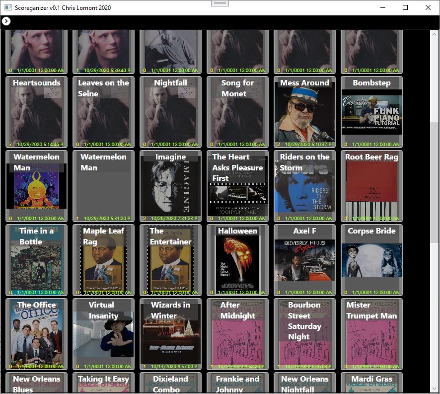
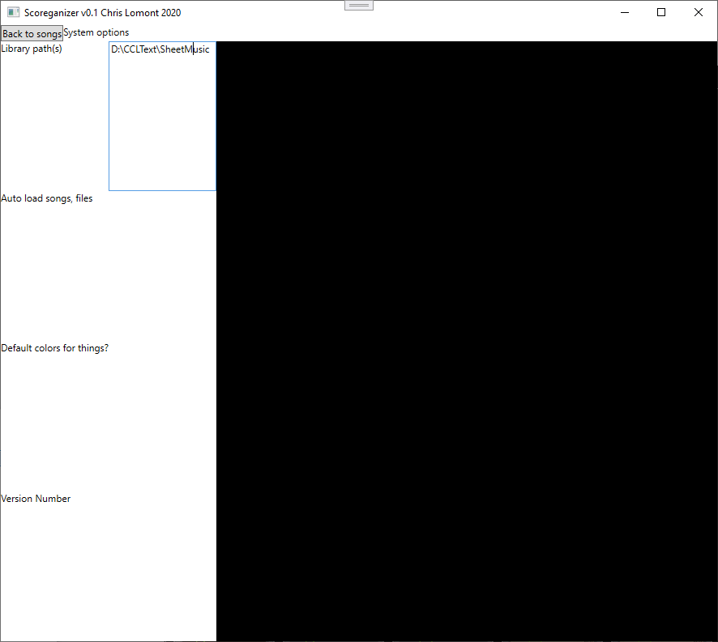
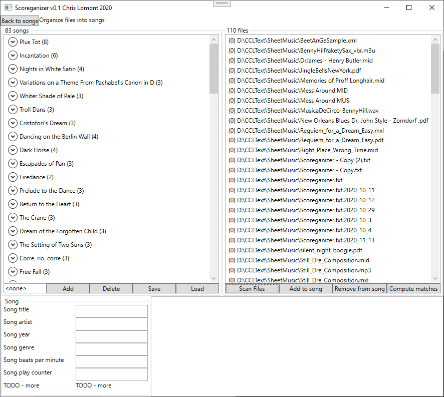
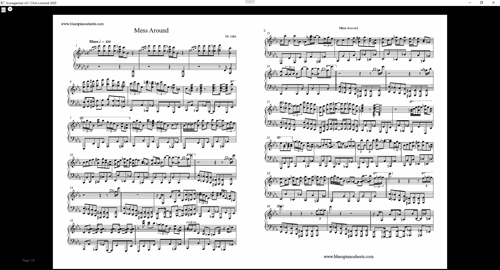
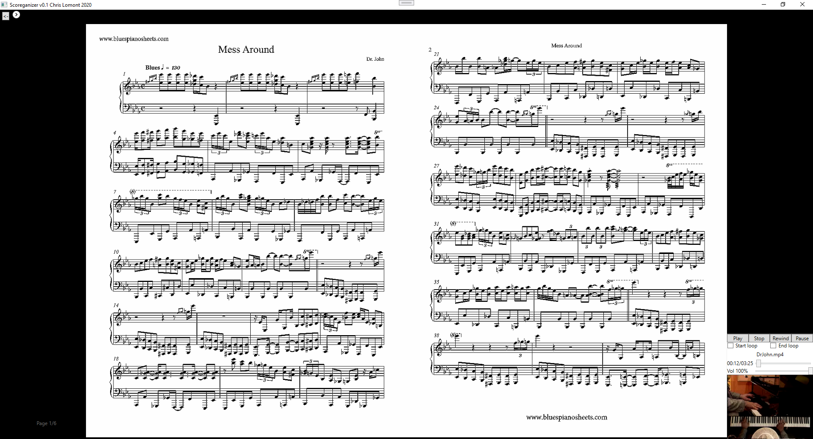
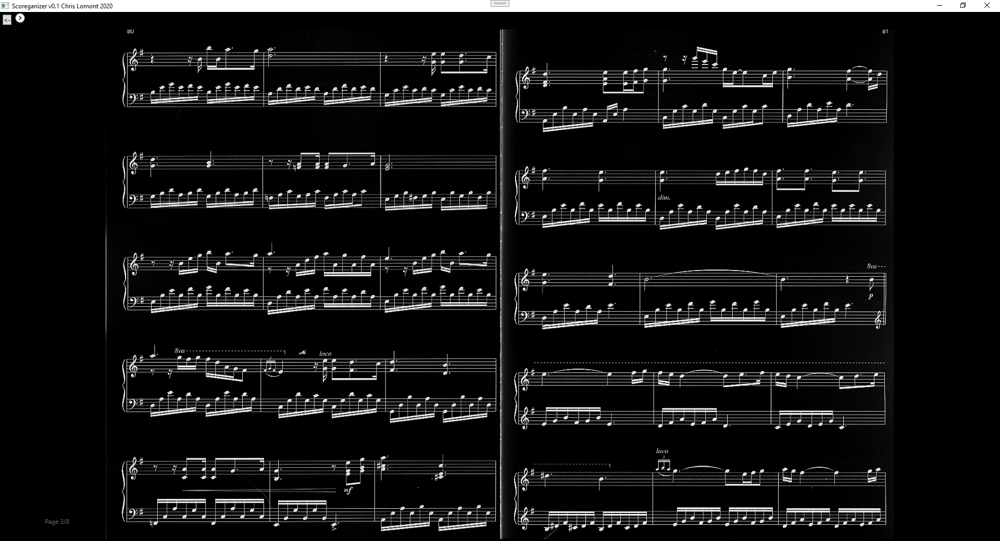

# Scoreganizer

Chris Lomont, Nov 2020,  http://lomont.org

This is a C#/WPF windows program I wrote to organize sheet music for playing on a piano. I built a touchscreen for using as a piano sheet music stand.

(TODO - insert pics and parts list I used)

## Getting Started

Build with Visual Studio (I used 2019). 

​	

1. Collect or make some sheet music. See the Section on how to organize your files.

2. Run the program. It opens on the Songs Page, which will be blank. 

3. Click the icon to open a command bar, and select the Options Page. 

4. On the Options Page, type in the path to your sheet music. 

5. Switch back to main view and close the program from the exit button (TODO - checkl this saves)

6. Open again, ensure your path is set. Then back up to the (blank) Songs Page, go to the Organize Page.

7. Select Scan all files to start the file scanner.

8. Add songs to groups on the right (TODO - describe). Click Save from time to time. Settings and changes in Scoreganizer auto save frequently (TODO - make more robust)

9. Add PDF, mp3, mp4, images, etc., to each song as you see fit.

10. When done, back to the Songs Page. 

11. You should see  a list of songs. Select one, open and use the top control bar to Play it.

12. On the Play page, tap right or left of the sheet music to switch pages. Using the options at the top you can open the media player to play and loop and pause, etc., video or audio files.

    

### Songs Page

Songs are named according to the edits in the Organize page. They get the first image in the associated files. 

### Options Page

Options show where to get all the song files. It is also where the system settings get stored.

### Organize Page

Organize is where you create Songs, and can edit metadata and add files to each Song.

### Play page

The Play Page is where you can view the sheet music for playback.

Here is the play page with a video playing of the song.

The view can be modified in a few ways from the drop down menu at the top. Here is inverted rendering.

## Organizing sheet music files

Organize files for sheet music all under one folder, with subfolders as you see fit. Currently Scoreganizer only displays PDFs, but MuseScore and other formats are planned.

You can also add mp3 and mp4 video files to have recordings of your music. You can also add jpg images to use as song cover images.

You can scan sheet music. Name the pages page01.png (or jpg..), page02.png, .... pageNN.png. Select them in Windows Explorer. Click on the first one (TODO - check how to do this cleanly), then right click and select print to PDF (built in Windows 10). Use this PDF.

THE END!